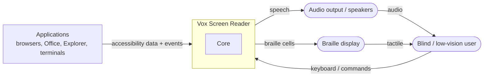
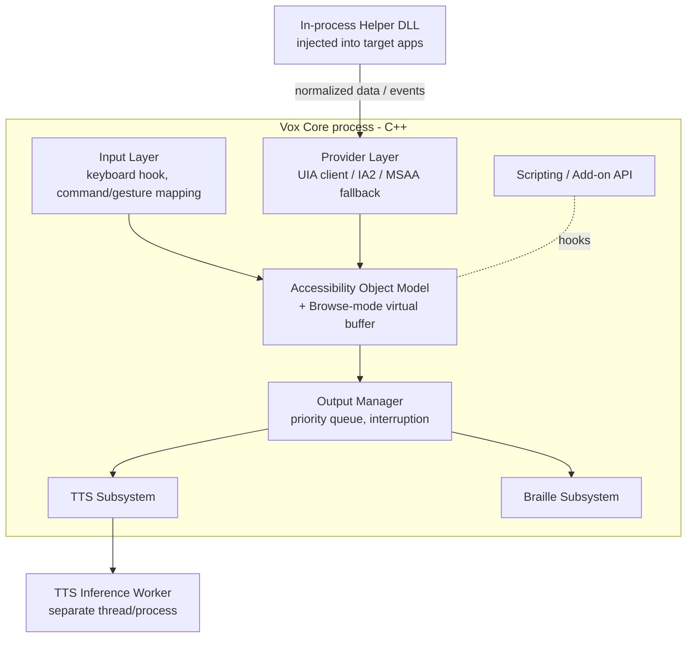
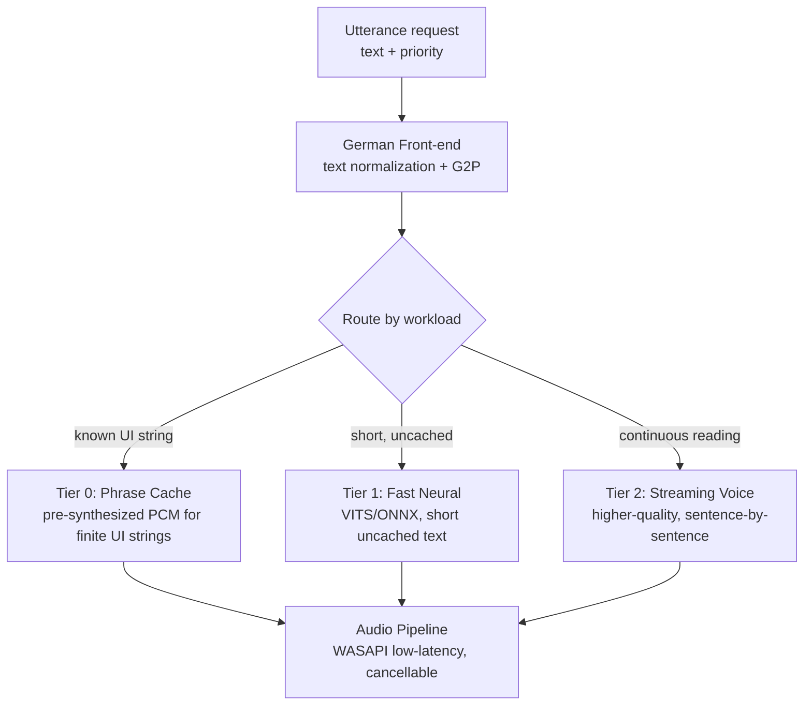
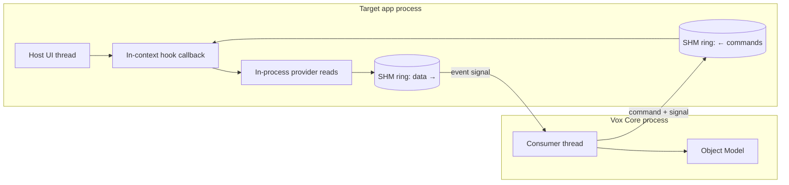
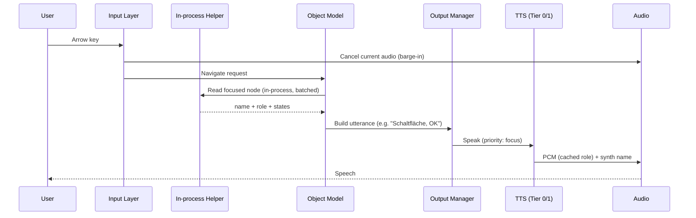
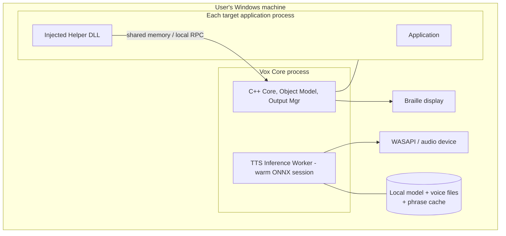
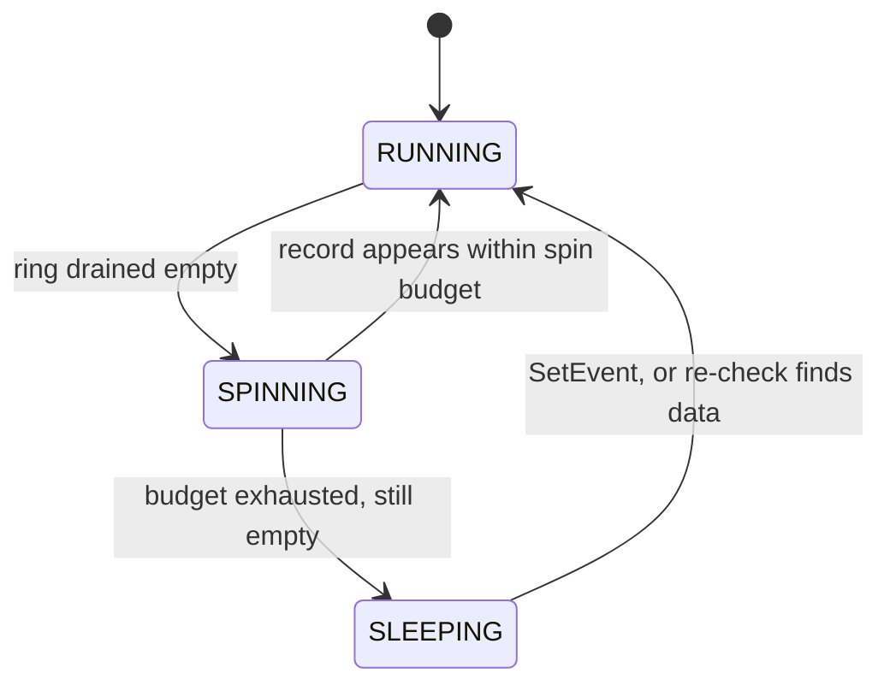
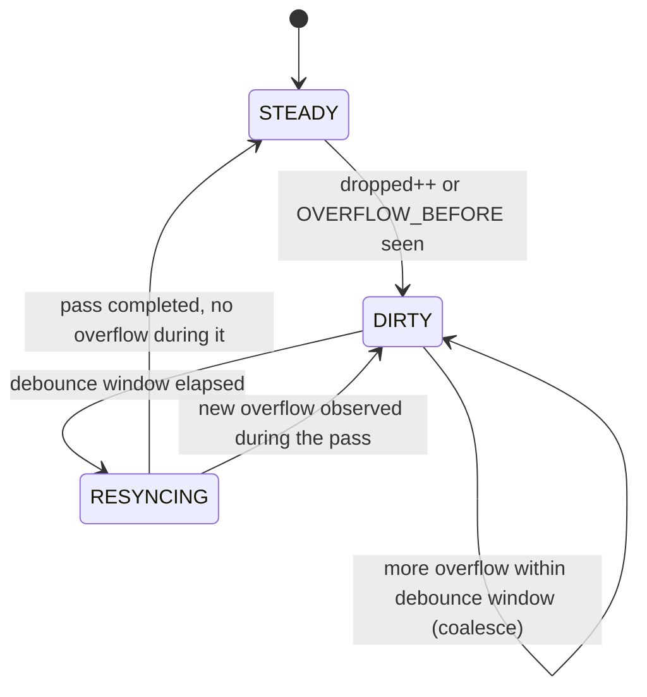

# Architecture Documentation — Vox Screen Reader

> **Product name:** *Vox* (Latin: "voice").
> **Format:** arc42 (v8 section structure). Markdown with embedded Mermaid diagrams for machine/AI readability.
> **Status:** Draft / design phase.
> **Scope of this document:** the architecture of a Windows screen reader focused on (1) low system overhead, (2) low speech latency, and (3) high-quality German text-to-speech.

---

## 1. Introduction and Goals

*Vox* is a Windows screen reader for blind and low-vision users. It conveys on-screen information through speech and braille, with a particular focus on the German language and on being noticeably lighter and more responsive than existing readers (NVDA, JAWS, Dolphin SuperNova).

### 1.1 Requirements Overview

- Announce focus, navigation, typing echo, and document content via speech and braille.
- Provide a "browse mode" virtual buffer for web pages and documents.
- Operate across the Windows desktop, standard controls, browsers, and office applications.
- Run on a typical laptop CPU **without a dedicated GPU**.
- Deliver natural, intelligible **German** output, including correct handling of numbers, dates, abbreviations, compounds, and umlauts/ß.

### 1.2 Quality Goals (top 3)

| # | Quality goal | Motivation | Concrete target |
|---|--------------|-----------|-----------------|
| Q1 | **Responsiveness / low latency** | A reader produces thousands of tiny utterances per hour; each must feel instant or navigation becomes unbearable. | Cached UI utterances effectively instant (playback only); uncached short text < 200 ms time-to-first-audio on a no-GPU laptop; continuous reading streams (first audio < ~300 ms). Reference points: legacy eSpeak ~5–10 ms, older Nuance ~50–150 ms. |
| Q2 | **Low system overhead** | The system must not feel slowed down by the reader; this is the primary user complaint about existing tools. | No perceptible degradation of host-app interactivity; minimize cross-process round-trips and event-handling cost. |
| Q3 | **German speech quality** | Existing readers speak German poorly. | Natural prosody and correct German normalization/pronunciation; intelligible at high speech rates (1.5–3×). |

Supporting goals: **stability/reliability** (the user depends on this software to operate the machine at all) and **maintainability**.

### 1.3 Stakeholders

| Role | Expectations |
|------|--------------|
| Blind / low-vision end users (German-first) | Fast, natural, reliable feedback; high-rate listening. |
| Power users / sysadmins | Configurability, scripting, braille support. |
| Core developers | Clear module boundaries; testable, debuggable C++. |
| Add-on developers | Stable scripting/extension API for app-specific modules. |
| Accessibility-API vendors (Microsoft, browser teams) | Standards-compliant use of UIA / IAccessible2. |

---

## 2. Architecture Constraints

| ID | Constraint | Consequence |
|----|-----------|-------------|
| C1 | Target OS is Windows (desktop). | Use Win32, UI Automation, IAccessible2, MSAA, WASAPI. |
| C2 | Must run on CPU only, no GPU dependency. | TTS models must be CPU-friendly (ONNX Runtime). |
| C3 | **User mode only** — no custom kernel-mode driver in the baseline. | A kernel bug = BSOD on accessibility-critical software; avoid driver-signing/attestation burden, EDR/anti-cheat conflicts, HVCI restrictions. (Optional, narrowly-scoped keyboard filter driver is a *future* reliability option, not a performance feature.) |
| C4 | Implementation language is **C++** for core, in-process helper, and audio/TTS pipeline. | Low per-call overhead, no GIL, direct COM, tight thread/memory control. |
| C5 | Must function on the secure desktop (UAC / login) for a complete experience. | Run an instance on the secure desktop (NVDA-style) rather than relying on a kernel driver. |
| C6 | Privacy: all speech synthesis runs locally/offline. | No cloud TTS in the core path. |
| C7 | Windows build uses a **Microsoft-ABI** toolchain (MSVC or clang-cl); **no MinGW/GCC** for shipping. | The helper is injected into MSVC-ABI host processes and uses the Windows SDK/COM; MinGW's separate ABI and runtime DLLs would clash. (See ADR-14.) |

---

## 3. Context and Scope

### 3.1 Business / System Context



| External interface | Direction | Via |
|--------------------|-----------|-----|
| User keyboard / commands | in | Low-level keyboard hook / raw input |
| Application UI state | in | UI Automation, IAccessible2, MSAA |
| Speech | out | WASAPI (low-latency) |
| Braille | out | Braille display drivers (USB/Bluetooth/serial) |

### 3.2 Technical Context

- **Information acquisition:** primarily UI Automation (UIA) with batched `CacheRequest`; **IAccessible2** for Chromium/Firefox documents; **MSAA** as last-resort fallback. Where it pays off, an **in-process helper DLL** is injected into the target application to read accessibility data directly in that process's address space, eliminating cross-process COM marshaling.
- **Output:** WASAPI for audio; vendor braille protocols for braille.
- **Inference:** ONNX Runtime (CPU) for neural TTS; espeak-ng as a grapheme-to-phoneme (G2P) library.

---

## 4. Solution Strategy

| Challenge | Strategy |
|-----------|----------|
| Avoid the cross-process round-trip bottleneck | Inject an **in-process helper** to read data in the app's address space; out-of-process UIA uses **batched cache requests**. |
| Keep the host responsive | **Event coalescing/debouncing**, **lazy tree construction** around focus, narrow event subscriptions. |
| Make speech feel instant | A **tiered TTS pipeline**: Tier 0 pre-synthesized phrase cache (playback only), Tier 1 fast neural for uncached short text, Tier 2 streaming higher-quality voice for continuous reading. **Instant barge-in** on any keypress. |
| Speak German well | A dedicated **German text-normalization + G2P front-end** plus a **German-trained acoustic model**; verify high-rate intelligibility. |
| Stay safe and maintainable | **User mode only**; C++ in hot paths; clear provider/output abstractions; scriptable add-ons. |

---

## 5. Building Block View

### 5.1 Level 1 — Whitebox: Vox Core



| Building block | Responsibility |
|----------------|----------------|
| **Input Layer** | Capture keystrokes (user-mode low-level hook / raw input), map to commands/gestures, manage key capture. |
| **Provider Layer** | Abstract UIA / IA2 / MSAA behind one interface; choose the best provider per app; receive data from the in-process helper. |
| **Accessibility Object Model + Browse-mode buffer** | Normalized, provider-independent representation; on-demand tree around focus; offline document model for browse mode. |
| **Output Manager** | Single priority queue feeding speech and braille; owns interruption/barge-in and message priorities. |
| **TTS Subsystem** | Tiered synthesis (see 5.2); routing, caching, streaming, rate control. |
| **Braille Subsystem** | Translation tables, display driver management, routing keys. |
| **Scripting / Add-on API** | App-specific modules and user scripts. |
| **In-process Helper DLL** | Injected into target apps; reads accessibility data in-process; forwards normalized data/events to Core over a lightweight channel (shared memory / local RPC). |
| **TTS Inference Worker** | Hosts the warm ONNX session(s); isolated so model load/inference never stalls Core. |

### 5.2 Level 2 — Whitebox: TTS Subsystem (the key differentiator)



| Tier | Workload | Engine | Latency profile |
|------|----------|--------|-----------------|
| **0 — Phrase cache** | Roles, states, digits, letters, common announcements (finite set) | Pre-synthesized once in the best German voice; stored as PCM | Effectively instant (playback only), high quality |
| **1 — Fast neural** | Arbitrary short uncached text | VITS-style model exported to ONNX (Piper-class), CPU faster-than-real-time | < 200 ms time-to-first-audio target |
| **2 — Streaming voice** | Paragraphs, documents, browse mode | Higher-quality German voice, synthesized incrementally and streamed | First audio ~300 ms acceptable; quality prioritized |

The **German Front-end** is shared by all tiers: number/date/currency/ordinal expansion, abbreviation handling ("z. B." → "zum Beispiel"), compound and foreign-word handling, and G2P (espeak-ng or a dedicated German phonemizer).

### 5.3 Level 2 — Whitebox: In-process Helper

**Design principle — the helper is minimal.** It executes inside another vendor's process, so its only job is the reads and event capture that *must* happen in-context to avoid cross-process marshaling. Everything else stays in Core. Because a fault or leak in the helper damages the *host* application, blast radius is minimized by keeping the helper small, allocation-light, and CRT-light.

**Done in-process (in the host's address space):**

- Register **in-context** event hooks (`SetWinEventHook` with `WINEVENT_INCONTEXT`): the DLL is mapped into the host and the callback runs on the host thread.
- Read accessibility data directly through provider interfaces **without cross-process COM marshaling** — the entire reason for being in-process.
- Read control-specific data that is cheap in-process but expensive across the boundary: console screen-buffer text, rich-edit content via window messages, etc.
- Snapshot a **minimal normalized payload** (name, role, states, text range) into the shared-memory ring and return immediately.

**Delegated to Core (out of process):**

- The normalized Accessibility Object Model and the browse-mode virtual buffer.
- All policy/decision logic, command handling, configuration, profiles.
- The entire TTS subsystem (front-end, all tiers, inference) and braille.
- Anything heavy, anything that can block, anything that can crash.

> **Rule of thumb:** if it isn't *both* latency-critical *and* marshaling-sensitive, it does not belong in the helper.

**Helper ↔ Core channel:**

- **Transport:** a lock-free **single-producer/single-consumer (SPSC) ring buffer in named shared memory** carries the high-frequency Helper→Core data flow; a second small ring carries Core→Helper commands. No COM call crosses the boundary on the hot path — that is exactly what we are eliminating.
- **Payload:** compact fixed-layout POD records with length-prefixed **UTF-16** strings (Windows-native, no transcoding), zero-copy where possible. No general-purpose serialization library.
- **Wakeup:** a named auto-reset event (or `WaitOnAddress`) wakes Core; a brief adaptive spin before blocking shaves latency on bursts without burning CPU when idle.

**Injection & lifecycle:**

- **Inject** via a global hook (`SetWindowsHookEx` / `SetWinEventHook` map the DLL into target processes) rather than `CreateRemoteThread` where possible — gentler and well-trodden.
- **`DllMain` does the absolute minimum:** no `LoadLibrary`, no heavy init, no blocking — the loader lock makes that unsafe. Real initialization is deferred to the first hook callback or an init command.
- **Bitness:** ship both 32-bit and 64-bit helpers; a 64-bit Core must talk to 32-bit helpers, so the shared-memory record layout is **fixed-width and bitness-agnostic**.
- **Isolation:** SEH guards around hook callbacks; a Core-side watchdog detects a wedged or absent helper and falls back to out-of-process UIA. The host UI thread is **never** blocked — callbacks only snapshot and return.



---

## 6. Runtime View

### 6.1 Scenario: User arrows to a control (latency-critical)



### 6.2 Scenario: Continuous reading ("read all")

1. User issues "read all"; Output Manager requests the document text stream from the browse-mode buffer.
2. TTS Tier 2 synthesizes sentence-by-sentence; audio begins after the first chunk while later sentences synthesize ahead (look-ahead buffer).
3. Any keypress triggers **barge-in**: the audio pipeline cancels immediately, the synthesis worker aborts the in-flight chunk, and the queue is flushed.

### 6.3 Scenario: Application without UIA quality

Provider Layer detects poor/absent UIA, falls back to IA2 (browser) or MSAA; if a per-app add-on exists, its module supplies hints. Object Model normalizes regardless of source.

---

## 7. Deployment View



- One **Core process**; a **Helper DLL** instance lives inside each instrumented app process.
- A separate instance runs on the **secure desktop** for UAC/login.
- All models, voices, and the phrase cache ship and run **locally**.

---

## 8. Cross-cutting Concepts

- **Performance / data acquisition:** in-process reads first; batched UIA `CacheRequest` otherwise; event coalescing; lazy trees; never block the Core thread on synthesis or I/O.
- **Interruption (barge-in):** a first-class concern across Input → Output → TTS → Audio. Small audio buffers, cancellable synthesis worker, flushable queue.
- **Threading model:** Core event handling, synthesis, and audio rendering on separate threads; lock-free hand-off where feasible.
- **German language handling:** centralized in the TTS front-end; rules and lexicons are data, not code, so they're updatable.
- **Speech-rate scaling:** voices validated for intelligibility at 1.5–3×; rate handled without re-synthesis where possible.
- **Security/stability:** user mode only; helper injection guarded against failure so a host-app issue never crashes Core, and Core never crashes the host.
- **Extensibility:** provider plug-ins and add-on scripts behind stable interfaces.
- **Configuration & profiles:** per-app profiles; verbosity, punctuation, and voice settings.
- **Logging/diagnostics:** structured logs; opt-in, privacy-respecting.

### 8.1 Memory Management

**Principle — reuse, don't churn.** In hot paths (per-event, per-utterance, the audio render callback, the SHM ring) per-operation `new`/`delete`/`malloc`/`free` is avoided: it takes allocator locks, fragments the heap, and injects latency jitter that is fatal to an "instant" feel. Cold paths (startup, config load, model load) allocate freely with normal STL/CRT — they are not on the critical path.

Techniques applied to the hot paths:

- **Object pools / free lists** for recurring objects (node snapshots, utterance requests): recycle instead of free.
- **Arena / bump allocators** for transient per-operation scratch: allocate, use, then reset with a single pointer move — never free individually.
- **Pre-allocated ring buffers** for Helper↔Core and the audio pipeline — fixed size, zero per-message allocation.
- **Resident PCM**: the Tier-0 phrase cache lives in memory as pre-decoded PCM. The **audio render callback never allocates, never takes a contended lock, and never page-faults** (consider `VirtualLock` on audio buffers; guard against priority inversion).
- **Thread-local reusable scratch** (e.g., a growable UTF-16 buffer reset between utterances) instead of constructing fresh strings in loops.
- **Private heap** (`HeapCreate`; the Low-Fragmentation Heap is the default on modern Windows) per subsystem to isolate the allocations that remain and cut cross-thread contention.
- **Helper side**: write straight into the SHM ring → **zero allocation in the host's heap** on the hot path.

*Caveat:* pools and arenas add use-after-reset and lifetime risk and real complexity. Apply them where a profiler shows allocation cost, not pre-emptively — premature pooling is its own class of bug.

### 8.2 Runtime & Library Footprint

- **C runtime:** statically link the compiler runtime (no Visual C++ Redistributable to install or mismatch) and rely on the Universal CRT, which ships as part of Windows 10+. See ADR-08.
- **Hot-path library discipline:** prefer direct Win32/NT APIs over heavy abstractions in hot paths — no `<iostream>`/`<fstream>`, no `std::regex`, no `<locale>`, no large dependency trees in the helper. This is a *hot-path* rule, not a blanket ban; the STL is used freely in cold paths. See ADR-09.
- **Helper minimalism:** the injected DLL disables exceptions/RTTI and minimizes (or statically links a trimmed) CRT to keep its footprint tiny and avoid clashing with the host's own runtime.

### 8.3 Helper↔Core Channel Contract (SPSC ring)

The high-frequency Helper→Core path is a **lock-free single-producer/single-consumer (SPSC) ring** in a named shared-memory section. SPSC is chosen deliberately: with exactly one producer and one consumer the queue needs only two atomic cursors and a release/acquire handshake — no locks, no CAS. Multiple producing threads in a host get **one ring each** (preserving SPSC); Core's consumer multiplexes across rings.

#### 8.3.1 Shared-memory layout & cursors

Backed by `CreateFileMapping` (pagefile-backed) + `MapViewOfFile`. The control block is fixed-layout and **identical under 32-bit and 64-bit** builds, so a 64-bit Core and a 32-bit helper agree byte-for-byte. Indices are **32-bit monotonic byte counters**: 32-bit atomics are lock-free on both bitnesses, and unsigned wraparound math is exact as long as `capacity ≤ 2^31`.

```cpp
// Little-endian, fixed layout, asserted identical on both bitness builds.
constexpr uint32_t VOX_MAGIC = 0x31584F56;           // "VOX1"
enum ConsumerState : uint32_t { RUNNING=0, SPINNING=1, SLEEPING=2 };

struct alignas(64) ProducerBlock {                   // written by helper only
    std::atomic<uint32_t> write;                     // monotonic byte counter
    std::atomic<uint32_t> dropped;                   // overflow counter (producer-owned)
    uint32_t _pad[14];                               // own cache line → no false sharing
};
struct alignas(64) ConsumerBlock {                   // written by Core only
    std::atomic<uint32_t> read;                      // monotonic byte counter
    std::atomic<uint32_t> state;                     // ConsumerState
    uint32_t _pad[14];                               // own cache line
};
struct alignas(64) RingHeader {
    uint32_t magic, version, capacity, producer_pid; // capacity is a power of two
    uint32_t _pad0[12];
    ProducerBlock prod;                              // separate cache line
    ConsumerBlock cons;                              // separate cache line
    // followed by: alignas(64) uint8_t data[capacity];
};
struct RecordHeader { uint32_t length; uint16_t type; uint16_t flags; };
static_assert(sizeof(RecordHeader) == 8);            // + offsetof asserts in both builds
```

The single most important layout rule: **`write` and `read` live on separate 64-byte cache lines.** Sharing a line makes every producer write invalidate the consumer's line (and vice versa), turning a lock-free queue into a cache-line ping-pong.

#### 8.3.2 Record framing

Each record is `RecordHeader` + payload, the whole thing **padded to an 8-byte multiple** so the next header is aligned. Payload is POD fields plus length-prefixed UTF-16 strings (no transcoding, no serialization library). `length` covers the header and is how the consumer advances.

Records are **never split across the wrap boundary** — that keeps consumer reads zero-copy. When a record would straddle the end, the producer first writes a `PAD` record filling the tail (`length = bytes-to-end`, `type = PAD`) and places the real record at offset 0. The consumer treats `PAD` as "advance and continue." Physical offset is always `counter & (capacity-1)`.

#### 8.3.3 Publication & memory ordering

The correctness invariant is a single release/acquire pair:

- **Producer:** write the full record bytes → **release-store** the new `write`. The release store is the publish point.
- **Consumer:** **acquire-load** `write` → only then read the record bytes.

This guarantees the bytes are visible before the index that exposes them. It also gives **crash consistency for free**: a record is published only by the post-write release store, so a producer crash mid-write leaves an *unpublished* record the consumer never sees — no torn reads. Free-space accounting uses the mirror pair (consumer release-stores `read`; producer acquire-loads it before reusing space).

#### 8.3.4 Wakeup protocol (eventcount)

Goal: low latency on bursts without a core spinning hot on a laptop, and **no syscall per record** under sustained load. The consumer drains, then spins briefly, then sleeps; the producer signals **only if the consumer is actually asleep**.



The lost-wakeup race is closed by a double-check on both sides (the `state` handshake uses seq_cst; the data path stays release/acquire):

- **Consumer** before sleeping: store `state = SLEEPING` → **re-check** `write`; if data is now present, store `RUNNING` and keep draining; otherwise `WaitForSingleObject(event)`.
- **Producer** after publishing: load `state`; if `SLEEPING`, `SetEvent(event)`.

Cross-process wakeup uses a **named auto-reset Event**, not `WaitOnAddress` — `WaitOnAddress`/`WakeByAddress` key on a virtual address, which differs between the two processes' mapped views, so it is unreliable across the boundary. The auto-reset Event also *latches* a signal raised in the gap between "set SLEEPING" and "wait," so a wake is never lost. The cost (a syscall on wake) is paid only at the **start** of a burst; under sustained load the consumer stays RUNNING/SPINNING and the producer issues no syscall at all. Across multiple rings, Core waits on the set of events with `WaitForMultipleObjects`.

#### 8.3.5 Backpressure & overflow (the event-storm case)

**The producer never blocks and never waits for space** — it runs on the host UI thread, and blocking there would freeze the application the user is sitting in. So the channel is **lossy by design, correct by resync**:

1. **Coalesce at the source first.** The helper collapses repeated events for the same (object, property) before enqueuing — the first and cheapest line of defense against a storm.
2. **On insufficient space:** drop the record, increment `dropped`, and set an `OVERFLOW_BEFORE` flag on the next record that *does* fit.
3. **Consumer resync.** When Core sees `dropped` advance (or the overflow flag), it treats its cached view of the affected objects as stale and **re-queries current state** from the authoritative provider (UIA/IA2). This is safe precisely because the user only needs the *current* state, never the intermediate history — the ring carries hints; the provider is the source of truth.
4. **Sizing.** Pick capacity to absorb normal bursts (hundreds of KB to ~1–2 MB — shared memory is cheap); one ring per producing thread avoids contention and keeps SPSC.

#### 8.3.6 Lifecycle, versioning, security

- **Setup:** Core creates the mapping and event in a per-session private namespace, **ACL'd to the user's SID**, with a **random nonce in the name** delivered to the helper out-of-band (injection parameter). This prevents another process from squatting or opening the channel.
- **Versioning:** `magic` + `version` are validated on attach; a mismatch means *do not use the ring* — fall back to out-of-process UIA.
- **Teardown:** each side waits on the other's process handle; on peer death it unmaps and (helper) stops producing / unloads. Combined with §8.3.3, a peer crash can corrupt neither side's view.

### 8.4 Record Catalog

Every record is `RecordHeader` + payload (§8.3.2). Object-bearing records begin the payload with a common **ObjectRef** so Core can correlate the hint with its object model and, on overflow, re-query the authoritative source:

```cpp
struct ObjectRef {                  // identifies an element across processes
    uint8_t  providerKind;          // UIA | IA2 | MSAA | CONSOLE
    uint8_t  _reserved;
    uint16_t runtimeIdLength;       // bytes of the id blob that follows
    // followed by: the provider-native id (UIA RuntimeId int[]; IA2 uniqueID; or HWND+childId)
};
```

Strings are length-prefixed UTF-16. **States are passed provider-native; Core normalizes** them into its provider-independent state model (keeps the helper minimal, ADR-03). Crucially, **bulk content is never shipped through the ring** — a record carries the *event*, not the document. When Core needs the text of an edit control or a document range, it reads it on demand through the text interface (in-process where that pays). This keeps records small and reinforces the lossy-by-design transport.

| Record type | Meaning | Key payload fields (after ObjectRef) |
|-------------|---------|--------------------------------------|
| `FOCUS_CHANGED` | Keyboard focus moved (highest-priority hint) | role, name, normalized-pending states, value |
| `PROPERTY_CHANGED` | A tracked property changed | propertyId, new value |
| `STATE_CHANGED` | Toggle / expand / pressed / busy changed | changed-state mask, new states |
| `SELECTION_CHANGED` | Selection in a list / tree / grid | container ref, selected count, item refs |
| `TEXT_CHANGED` | Text inserted/removed in an edit or document | range (start, length), change kind |
| `TEXT_SELECTION_CHANGED` | Caret/selection range moved | anchor offset, active offset |
| `VALUE_CHANGED` | Slider / progress / spinner value | numeric value, min, max |
| `STRUCTURE_CHANGED` | Children added/removed/reordered (browse-mode invalidation) | parent ref, change kind |
| `LIVE_REGION_CHANGED` | ARIA/UIA live region updated | politeness, text |
| `NOTIFICATION` / `ALERT` | UIA notification or alert | text, activity hint |
| `FOREGROUND_CHANGED` | Foreground window changed | HWND, window ref, title |
| `WINDOW_OPENED` / `WINDOW_CLOSED` | Dialog/window lifecycle | HWND, title |
| `MENU_START` / `MENU_END` / `TOOLTIP_SHOWN` | Transient UI | text |
| `CONSOLE_OUTPUT` | Console wrote text (in-process console reader) | HWND, region, text |
| `PAD` | Internal wrap filler (§8.3.2) | none — `length` only |

`flags` on any record may carry `OVERFLOW_BEFORE` (events were dropped before this record — trigger resync, §8.5).

### 8.5 Resync State Machine (Core)

When the channel drops under a storm (§8.3.5), Core recovers by re-reading authoritative state. The recovery is debounced and throttled so that resync never becomes its own storm, and it always re-establishes **current focus and its announceable state first**, deferring everything off-screen.



| Concern | Rule |
|---------|------|
| **Trigger** | Consumer observes `dropped` advanced or an `OVERFLOW_BEFORE` flag. |
| **Scope** | Minimal by default: re-read the current focus object and its announceable context; in browse mode, mark the affected virtual-buffer region dirty for lazy rebuild. Escalate to full foreground-window resync only on repeated overflow or a `FOREGROUND_CHANGED` loss. |
| **Debounce** | Coalesce overflow signals over a short window (~20–50 ms) into a single pass — avoids one-resync-per-dropped-event during an ongoing storm. |
| **Throttle / back off** | While a storm persists (dropped still climbing), cap resync frequency and re-read only current focus/state each pass; defer full subtree rebuilds until `dropped` stabilizes. |
| **Priority** | Focus and its state first (that is what the user needs *now*); off-screen and ancestor detail later. |
| **Idempotency** | A resync pass only reads authoritative state, so it is safe to repeat; re-running simply refreshes. |

### 8.6 Engineering & Code-Quality Practices

These practices are part of the architecture: at this performance target and reliability bar (the user operates the machine through this software), quality cannot be retrofitted.

#### 8.6.1 Test strategy and TDD

- **TDD for the deterministic core.** The performance- and correctness-critical logic is pure and fast to test, so write the test first: the SPSC ring index math, record framing/codec, German normalization and G2P rules, the resync scope/debounce logic, braille translation, and command parsing. Red-green-refactor genuinely fits these.
- **A testability seam at the speech boundary (ADR-12).** The Output Manager exposes the *would-be-spoken text* as an inspectable artifact **before** it reaches TTS. Tests then assert "navigating to this control produces utterance X" on text, not audio — making behavior testable without sound hardware or a real synthesizer.
- **Test pyramid.** Many fast unit tests over the pure cores; a thinner integration tier driving a **purpose-built test application** with known UIA/IA2 trees; a small end-to-end tier asserting on captured utterance text. Avoid trying to automate audio assertions — assert upstream.
- **Fakes behind interfaces.** Provider, TTS engine, audio sink, and braille display sit behind interfaces with fakes, so object-model and output logic run in isolation.

#### 8.6.2 Coverage — measured where it means something

- Target **high branch coverage (≥ ~90%)** on the pure cores (codec, normalization, ring, resync, diffing).
- Coverage is a guardrail, not a goal: branch coverage of normalization/parsing **edge cases** matters; line coverage of trivial getters does not. Do not chase 100% by testing the trivial — and never write assertions that merely re-state the implementation.
- **The OS-glue adapters are unit-covered too, with no real device (issue #68).** Each adapter exposes a narrow test seam — a factory the test fills with **mock COM objects** (`IMMDeviceEnumerator`→`IAudioClient`→`IAudioRenderClient`; `ISpVoice` + the SAPI token chain; `IUIAutomation`→element→patterns) or, for the keyboard hook, a fake `SetWindowsHookEx` plus the per-key decision factored into a pure `processKey`. The mocks fault-inject every `HRESULT`, so the acquisition, error, synthesis, extraction, and decision paths run in the ordinary coverage job. This is what ADR-12's pure-core/thin-adapter split buys: with the COM creation injected, the glue's branches are reachable from a test. A *real* device/voice/hook is still exercised by the labelled `*_itest` integration tests, but coverage no longer depends on one.
- **The application is a testable object, not logic in `main()`.** `vox::app::App` holds its collaborators (provider, TTS, audio behind their interfaces; the keyboard hook behind `IInputHook`) and runs the start → wait-for-exit → stop loop, so the run-loop and its fatal-error handling are unit-tested with fakes. The Windows composition root — `makeDefaultDependencies()` — builds the real stack and is itself covered hardware-free through the same SAPI seam (the only constructor that needs a voice). `main()` is then a one-line entry point that wires the two.
- The **SonarCloud new-code coverage gate therefore measures everything.** No production source is in `sonar.coverage.exclusions` — only the tests, which do not measure their own coverage. The handful of irreducibly OS-bound lines (the live-modifier read, the message loop, the callback's event unpacking) are exercised by the labelled `*_itest` integration tests.

#### 8.6.3 Concurrency, fuzz, and property testing

- **Sanitizers on the portable cores.** The ring, codec, normalization, and resync logic are OS-independent libraries (ADR-12), so a **separate, CI-only Clang build** runs them under **ThreadSanitizer, AddressSanitizer, and UBSan** — this is a *testing* toolchain, not the shipping compiler. The distinction matters because MSVC ships ASan but **not** TSan or UBSan, and TSan is exactly what the lock-free ring needs; Clang (and GCC, natively, on a future Linux port) provides the full set. See ADR-14 for the shipping-vs-testing toolchain split.
- **Race/stress the ring in isolation:** producer/consumer with randomized delays, deliberate slow-consumer + storm-producer scenarios to exercise overflow and the wakeup handshake, and multi-hour soak runs.
- **Property/round-trip tests:** `decode(encode(x)) == x` for the record codec; fuzz the record parser (it must be robust against malformed input even though we produce it).
- **Golden tests for German:** an input→expected corpus for normalization and pronunciation, **reviewed by a native speaker**, regression-tested; plus a high-rate (1.5–3×) intelligibility acceptance check on any voice change.

#### 8.6.4 Performance and memory testing

- **Microbenchmarks with percentile budgets.** Benchmark hot paths (ring enqueue/dequeue, codec, normalization, time-to-first-audio) and track **p50/p99/p99.9** — tail latency is what users feel, not the mean. Encode the §1.2/§10 budgets as pass/fail assertions.
- **A CI performance-regression gate** on stable, dedicated hardware compares against a baseline and fails on regressions beyond a relative threshold (use relative thresholds to absorb CI noise).
- **No-allocation enforcement.** A debug allocator **asserts on any allocation from the audio render thread or inside the in-context hook**, mechanically enforcing ADR-10 rather than trusting discipline.
- **Memory health:** leak detection (Application Verifier, CRT debug heap, ASan), allocation tracking on hot paths, and **24h+ soak tests** under continuous simulated navigation watching working-set/RSS for slow leaks and fragmentation.

#### 8.6.5 Naming and code style

- **Intention-revealing names; spell words out.** `phraseCache`, `consumerState`, `timeToFirstAudio` — not `pc`, `cs`, `ttfa`. Functions are verbs; types are nouns; booleans read as predicates (`isSleeping`, `hasOverflowed`).
- **Abbreviations only for established domain acronyms** — UIA, IA2, MSAA, TTS, G2P, PCM, SPSC, HWND, PID — and conventional loop indices. **No Hungarian notation** in our own code (it is a legacy Win32 convention, not a project one).
- **One enforced style:** a single `.clang-format` and `clang-tidy` ruleset gated in CI; `/W4 /WX` (warnings as errors). Header hygiene and include-what-you-use to cut coupling and build time.

#### 8.6.6 Design patterns vs. performance

The policy is **patterns for structure, data-oriented design for hot loops** (ADR-13).

- **Good fits (cold paths / module seams):** Strategy/polymorphism for the provider and TTS-engine abstractions; Factory for provider creation; Adapter wrapping OS APIs; Command for input→action mapping; Pimpl for ABI/build decoupling of the *stable add-on API*.
- **Avoid on hot paths:** virtual dispatch per event/sample, `std::function` in inner loops, `shared_ptr` churn, deep inheritance, exceptions for control flow, and Pimpl on hot-path objects (it adds indirection + an allocation). Prefer concrete types and contiguous data in the inner loops; measure before abstracting anything on the critical path.

#### 8.6.7 Tooling, CI, and review gates

- **CI builds both 32-bit and 64-bit**, runs the full test suite, the sanitizer builds, the clang-format/clang-tidy gates, the benchmark-regression gate, and the **cross-bitness wire-layout test** (asserts identical `sizeof`/`offsetof` for every shared struct — guards R12).
- **Static analysis:** clang-tidy (incl. Core Guidelines checks) and MSVC `/analyze`, plus a **SonarCloud** scan (`sonar.yml`) whose **quality gate is a required merge gate** — a pull request does not merge while the gate is red. Where a Sonar rule conflicts with a deliberate decision here (e.g. the lock-free ring's explicit memory orderings, the host-stability exception firewalls, or the unavoidable Win32/COM ABI casts at the OS-glue seam), the deviation is **suppressed in version control** with a justification (`sonar.issue.ignore.multicriteria` in `sonar-project.properties`) and recorded as documented technical debt, rather than silently resolved in the Sonar UI. ThreadSanitizer — not Sonar's static heuristics — is the authoritative gate for memory ordering (§8.6.3).
- **Mandatory review** against a short checklist: hot-path allocation? thread-safety/ordering? names? test added? graceful-degradation path?
- **Error-handling discipline:** exceptions permitted only in Core cold paths; the helper, audio callback, and hot paths use status/error codes. A fault must **degrade gracefully** (fall back to out-of-process, keep speaking) and **never crash the host**. Cold-path OS/COM failures are raised as the typed **`vox::OsError`** taxonomy (`vox::audio::DeviceError` / `vox::tts::EngineError` / `vox::input::HookError`), which carries the originating `HRESULT`/`GetLastError()` code so a handler can catch by subsystem and logs can report the native code.
- **Observability:** structured, leveled logging and counters (dropped records, resync count, latency histograms) for field diagnosis — opt-in and **privacy-respecting** (no announced content logged by default).
- **Reproducible builds:** pinned dependencies and **versioned models/voices**.
- **Run summaries:** CI publishes results so a run's health reads at a glance. Each test job writes a pass/fail/skip table to the run **Summary**, and three families of **per-run PR comments** are posted (each keyed to the run id, so a new run posts a fresh comment and a cancelled run stays quiet): a live **test ✕ job matrix** (per-job counts, a failures table, and a collapsible full matrix), a **SonarCloud** summary (quality gate + new-code coverage + open issues), and a **clang-tidy** summary (clean, or the diagnostics). The matrix is maintained by the bundled TypeScript **`test-matrix`** action (`.github/actions/test-matrix`, fed by `ctest --output-junit` from `just test`); the gate and tidy comments use the small **`upsert-comment`** composite action. The `test-matrix` action is unit-tested (`node:test`) and its own coverage is reported to SonarCloud via `c8` → lcov, run in the Sonar job.

#### 8.6.8 Dogfooding with target users — the real acceptance test

The decisive measure of success is not a coverage number; it is whether blind users navigating real applications in German find *Vox* fast and natural. **Test continuously with blind users and native German speakers from the first milestone**, run usability sessions each release, and let their feedback set priorities. An engineering team can pass every automated gate and still build the wrong thing without this. (See R14.)

---

## 9. Architecture Decisions (ADRs)

**ADR-01 — Implement core in C++ (not Python).**
*Decision:* C++ for Core, helper, and audio/TTS pipeline. *Rationale:* lower per-call overhead, no GIL on high-frequency event paths, direct COM, tight control. *Note:* language is a secondary lever; the dominant wins are architectural (caching, in-process reads).

**ADR-02 — User mode only; no kernel driver in baseline.**
*Decision:* No custom kernel-mode driver. *Rationale:* the accessibility data lives in user-mode app processes and is unreachable faster from ring 0; kernel bugs cause BSODs on accessibility-critical software; driver signing/attestation, EDR/anti-cheat conflicts, and HVCI restrictions add fragility for no latency gain. *Exception (deferred):* a narrowly-scoped keyboard filter driver may be revisited purely for capture reliability / secure-desktop reach, never for speed.

**ADR-03 — In-process injection for the fast path.**
*Decision:* inject a helper DLL into target apps to read accessibility data in-process. *Rationale:* eliminates cross-process COM marshaling — the real bottleneck. *Trade-off:* injection is invasive (AV friction, host stability); guard rigorously and fall back to out-of-process UIA.

**ADR-04 — Provider strategy: UIA (cached) + IA2 + MSAA fallback.**
*Decision:* UIA baseline with batched `CacheRequest`; IAccessible2 for browsers; MSAA last resort. *Rationale:* best speed/coverage per app class.

**ADR-05 — Tiered TTS pipeline.**
*Decision:* Tier 0 phrase cache, Tier 1 fast neural, Tier 2 streaming voice. *Rationale:* navigation utterances and continuous reading have opposite latency/quality needs; a single engine can't serve both well.

**ADR-06 — ONNX Runtime on CPU for neural inference.**
*Decision:* models exported to ONNX, run on CPU. *Rationale:* no GPU dependency (C2); broad model ecosystem (Piper-class VITS, Kokoro-class for reading). *Note:* benchmark quantization per target — int8 is not guaranteed faster than fp32.

**ADR-07 — Dedicated German front-end.**
*Decision:* a German normalization + G2P stage feeding all tiers, with a German-trained acoustic model. *Rationale:* much perceived German quality lives in normalization/G2P, not just the acoustic model.

**ADR-08 — C runtime: static-link the compiler runtime; rely on the OS Universal CRT; keep the helper CRT-minimal.**
*Decision:* link the compiler runtime statically (`/MT`) for Core and helper, so there is **no Visual C++ Redistributable dependency** to install or version-mismatch on end-user machines; rely on the Universal CRT (UCRT), which is part of Windows 10+. The in-process helper additionally minimizes or statically links a trimmed CRT and disables exceptions/RTTI, keeping its footprint tiny and avoiding clashes with whatever runtime the host already loaded.
*Consequences:* self-contained binaries (valuable for software installed this broadly) and no redist-version support calls, at the cost of larger binaries and the discipline that **CRT-owned objects (heap allocations, `FILE*`, locale) must never cross a module boundary** where each side links the CRT separately — each module frees what it allocated. (See R8.)

**ADR-09 — Prefer direct Win32 APIs over heavy library abstractions in hot paths.**
*Decision:* in hot paths, call Win32/NT APIs directly — `CreateFile`/`ReadFile`, `VirtualAlloc`/`HeapAlloc`, `SRWLOCK`, `WaitOnAddress`, `QueryPerformanceCounter`, WASAPI — and avoid heavy machinery: no C++ iostreams, no `std::regex`, no `<locale>`, no large dependency trees in the helper.
*Important nuance:* this is a **hot-path** rule, not a blanket ban. The STL and CRT are used freely in cold paths (init, config, parsing of settings). The dominant cost remains the accessibility round-trips, not `std::vector` — rewriting everything as raw calls is premature optimization and a maintenance/safety regression. Note also that on Windows, *"direct low-level system calls"* means the documented Win32/NT layer (kernel32/ntdll); issuing raw `syscall` instructions into ntdll is undocumented, unstable across builds, and must be avoided.

**ADR-10 — Memory: reuse buffers over per-operation alloc/free in hot paths.**
*Decision:* object pools, arenas, fixed ring buffers, and pre-allocated audio/PCM buffers on the hot paths; ordinary allocation on cold paths. The audio callback and the in-context hook are allocation-, lock-, and fault-free.
*Consequences:* predictable low latency and no hot-path fragmentation, at the cost of allocator complexity and lifetime discipline; applied guided by profiling. (See R9.)

**ADR-11 — Helper↔Core channel is a lossy SPSC ring; correctness comes from resync, not delivery guarantees.**
*Decision:* the channel is a lock-free SPSC ring (one per producing thread) that **drops under overflow** rather than blocking the producer; Core recovers by re-querying authoritative provider state. *Rationale:* the producer runs on the host UI thread, so it must never block; and the user only needs *current* UI state, which is always re-readable — so guaranteed delivery of every intermediate event is unnecessary and would be harmful. *Consequences:* requires source-side coalescing, an overflow signal, and a Core resync path; in exchange the host UI thread is never stalled and the design degrades gracefully under event storms. (See §8.3.5, R11.)

**ADR-12 — Testability via an inspectable speech seam and OS-independent hot-path cores.**
*Decision:* expose the would-be-spoken text at the Output Manager boundary (before TTS) as an inspectable artifact, and implement the performance-critical, OS-independent logic (SPSC ring, record codec, German normalization/G2P, resync, braille translation) as platform-independent libraries; put provider/TTS/audio behind interfaces with fakes. *Rationale:* makes behavior TDD-able and sanitizer-coverable (ASan/TSan/UBSan) without Windows or audio hardware; reserves the slower integration tier for OS glue only. *Consequences:* a small amount of indirection at boundaries (cold paths, harmless) buys broad, fast, deterministic test coverage. (Sanitizer coverage runs on a CI-only Clang build — see ADR-14.)

**ADR-13 — C++ Core Guidelines baseline; patterns for structure, data-oriented design for hot loops.**
*Decision:* adopt the C++ Core Guidelines, enforced by clang-format + clang-tidy and `/W4 /WX` in CI, with a short documented list of hot-path exceptions; intention-revealing names with abbreviations only for established domain acronyms; design patterns at module seams and cold paths but not in inner loops (no virtual dispatch, `std::function`, or per-item allocation there). *Rationale:* consistency and reviewability without sacrificing the latency budget. *Consequences:* the sanctioned-deviation list must be kept honest and current so the rules stay credible.

**ADR-14 — Toolchain: ship with MSVC or clang-cl (Microsoft ABI); use a separate CI-only Clang build for sanitizers; no MinGW/GCC on Windows.**
*Decision:* the Windows shipping binary is built with **MSVC** *or* **clang-cl** — both produce Microsoft-ABI output linking the UCRT/vcruntime (consistent with ADR-08), interoperate with MSVC-built host processes (which the helper is injected into), and integrate with the Windows SDK/COM. Support both in CI (cheap, since they share the ABI) and select the release compiler by **benchmark on the actual hot paths**, not by an assumed performance ranking. A **separate, non-shipping Clang build** runs the OS-independent cores under TSan/UBSan (which MSVC lacks). **MinGW/GCC is not used for shipping on Windows** — its distinct ABI and runtime DLLs (`libstdc++`, `libgcc_s`, `libwinpthread`) would clash with injected MSVC-ABI hosts; GCC is reserved for the future Linux port and for cross-checking the portable cores.
*Rationale:* keeps the production binary in the Microsoft-ABI world (required by the injection model and ADR-08) while still getting LLVM's full sanitizer suite for the lock-free code. Compiler optimization differences between MSVC/clang-cl/GCC are small and workload-dependent, so the choice is measured, not assumed.
*Consequences:* the build system (CMake, per the portability seam) must support MSVC and clang-cl as first-class Windows toolchains plus a Clang sanitizer configuration; the benchmark-regression gate (§8.6.4) is what decides the release compiler.

**ADR-15 — License: Apache-2.0 with a CLA; copyright kept consolidated for relicensing flexibility.**
*Decision:* ship first-party code under **Apache-2.0** (warranty/liability disclaimer, attribution via `NOTICE`, explicit patent grant + retaliation — valuable given in-process injection). The copyright holder / project owner is **Digitale Barrierefreiheit e.V.** (a non-profit association, Nuremberg, Germany). Require every contributor to sign a **Contributor License Agreement** granting the owner the right to **relicense, including under non-open-source terms**, enforced by CI. Every source file carries an SPDX header.
*Rationale:* a permissive public license plus consolidated copyright ownership is the only combination that lets future versions be relicensed (or closed) — the license text alone cannot do this; ownership can. Already-published versions remain irrevocably Apache-2.0 and forkable; only future versions are controllable.
*Consequences:* a CLA adds contributor friction and must be legally reviewed; the project must avoid copyleft dependencies in linked binaries (ADR-16), or the dependency's license would override this freedom.

**ADR-16 — Copyleft isolation: GPL G2P (espeak-ng) runs in a separate process, never linked into Core.**
*Decision:* keep the German G2P (espeak-ng, **GPLv3**) **out of every first-party binary**. Host it inside the already-separate **TTS inference worker process** (§5.1/§7), which is hereby pinned to be a distinct *process* (not merely a thread). Core (proprietary-capable) performs German text normalization and sends clean text across the existing arm's-length boundary; the worker phonemizes and synthesizes, returning PCM. The phoneme interface is a simple, standard interchange (text → phoneme string → PCM), reinforcing the "separate work" boundary. The worker binary is distributed under GPLv3 with source; it is an optional, replaceable component.
*Rationale:* GPL is viral on linked/combined works — linking espeak-ng into Core would force the whole product to GPLv3 and forbid relicensing (ADR-15). The TTS worker boundary already exists in the architecture for crash/stall isolation, so isolating G2P there adds **no new process hop**: the Output Manager already hands utterance text to the worker and already receives PCM back. G2P is rule/dictionary-based (sub-millisecond per utterance) and is dwarfed by neural acoustic inference; it is off the audio-callback and in-context-hook hot paths entirely. Hence isolation has **negligible latency cost** versus the Q1 budget, while a permissive-G2P swap remains the fallback if measurement or legal review says otherwise.
*Consequences:* the German front-end is split across the Core↔worker boundary (normalization in Core, phonemization in worker); the build produces the worker as a separate GPLv3 target with its own headers/NOTICE; the arm's-length boundary, while defensible, must be confirmed by counsel; a microbenchmark must verify the per-utterance G2P + IPC cost stays well under the time-to-first-audio budget. *Fallback:* replace espeak-ng with a permissively-licensed German phonemizer/lexicon if either the legal boundary or the measured cost proves unacceptable. (See R16.)

---

## 10. Quality Requirements

### 10.1 Quality Tree (summary)

- **Performance**
  - Latency (Q1): cached utterances instant; uncached short < 200 ms; reading streams.
  - System overhead (Q2): no perceptible host slowdown.
- **Usability**
  - German naturalness (Q3); high-rate intelligibility.
- **Reliability:** no host crashes; graceful provider fallback.
- **Maintainability:** clear module boundaries; testable C++.

### 10.2 Quality Scenarios

| ID | Scenario | Response measure |
|----|----------|------------------|
| QS1 | User holds arrow key, scanning a list rapidly. | Each item announced with no perceptible lag; cached role strings instant. |
| QS2 | User presses a key during "read all". | Audio stops within a few ms; new utterance starts promptly. |
| QS3 | German text with numbers, dates, abbreviations, compounds. | Correctly expanded and pronounced. |
| QS4 | User sets 2.5× speech rate. | Output remains intelligible. |
| QS5 | Heavy web app fires bursts of UIA events. | Events coalesced; host stays responsive; Core CPU bounded. |
| QS6 | Target app crashes while instrumented. | Core survives; provider falls back; no Core crash. |

---

## 11. Risks and Technical Debt

| ID | Risk | Mitigation |
|----|------|-----------|
| R1 | In-process injection conflicts with antivirus/EDR or destabilizes hosts. | Robust guards; out-of-process fallback; allow-list cooperation with AV vendors. |
| R2 | Neural TTS too slow per-utterance on low-end CPUs. | Tier 0 cache covers the frequent case; Tier 1 kept small; benchmark on minimum-spec hardware. |
| R3 | German front-end edge cases (foreign words, rare compounds) mispronounced. | Data-driven lexicons; user-correctable pronunciation dictionary. |
| R4 | Building a full reader is enormous (browse mode, Office, terminals, braille). | Stage delivery; consider proving the German low-latency TTS first (even as an NVDA add-on) before the full reader. |
| R5 | Secure-desktop operation complexity. | Reuse NVDA-style separate-instance approach; no kernel driver. |
| R6 | High-rate intelligibility regressions when changing voices. | Add high-rate intelligibility to the voice acceptance test suite. |
| R7 (debt) | MSAA fallback paths under-tested. | Track coverage; prioritize most-used legacy apps. |
| R8 | CRT-owned objects passed across statically-linked module boundaries → heap corruption. | Strict ownership: each module frees its own; pass POD records / handles across boundaries, never CRT objects. |
| R9 | Pool/arena misuse → use-after-reset / dangling-pointer bugs. | Apply selectively and profile-driven; debug-build poisoning and asserts on reset. |
| R10 | `DllMain` loader-lock violations in the helper. | Keep `DllMain` minimal; no `LoadLibrary` or blocking under loader lock; defer init to first callback. |
| R11 | Sustained event storm overflows the ring; events lost. | Source-side coalescing; overflow flag triggers Core resync of current state (lossy-by-design, ADR-11); size rings for typical bursts. |
| R12 | Cross-bitness control-block layout drifts between 32-bit and 64-bit builds → silent corruption. | Fixed-width fields; `static_assert` on `sizeof`/`offsetof` in both builds; CI builds and a wire-layout test for both bitnesses. |
| R13 | Lost-wakeup or false-sharing bug in the lock-free ring. | Cursors on separate cache lines; seq_cst state handshake with double-check (§8.3.4); stress + race testing (TSan-style) on the ring in isolation. |
| R14 | Built without continuous input from blind users / native German speakers → wrong priorities, unnatural speech. | Dogfood with target users from the first milestone; native-speaker review of the German corpus; usability sessions every release (§8.6.8). |
| R15 | Performance regressions creep in unnoticed. | CI benchmark-regression gate on stable hardware with percentile budgets; no-allocation asserts on the audio and hook threads (§8.6.4). |
| R16 | GPLv3 espeak-ng "contaminates" the product, blocking relicensing (ADR-15/16); or the process-isolation boundary is later judged a combined work; or IPC cost erodes the latency budget. | Never link GPL into Core; host G2P only in the separate worker process behind a simple text→phoneme interface; legal review of the boundary; microbenchmark the per-utterance G2P + IPC cost against the TTFA budget; keep a permissively-licensed phonemizer as a ready fallback. |
| R17 (debt) | Some SonarCloud rules are deliberately suppressed where they conflict with this architecture — explicit lock-free memory orders (S8417), host-stability exception firewalls (S1181/S2486/S2738/S108), and unavoidable Win32/COM ABI casts at the OS-glue seam (S5008/S3630). The #68 COM test doubles add the same shape on the test side, confined to the generated mock vtables (`tests/**/*_com_mocks.hpp`): a class that must *be* a COM object is forced into `void**` params (S5008), interface-sized method counts (S1448), and the OS callback typedef (S5205). Copy/paste analysis is likewise scoped to `src/` since those vtables are inherently repetitive. The risk is masking a *genuine* future issue behind a suppression. | Suppressions live in `sonar-project.properties` (version-controlled, reviewable, maintainer-approved, each with a rationale and scoped per-file/glob, not the whole tree); **ThreadSanitizer** is the authoritative gate for memory ordering, not Sonar's static heuristic (§8.6.3). The dedicated-exception rule (S112) is no longer suppressed — the `vox::OsError` taxonomy added in #63 resolved it (the test doubles throw it too). Revisit the suppression list when rules or the design change. |

---

## 12. Glossary

| Term | Definition |
|------|-----------|
| **UIA (UI Automation)** | Microsoft's modern accessibility API; user-mode, COM-based. |
| **CacheRequest** | UIA mechanism to fetch multiple properties/nodes in one cross-process call. |
| **IAccessible2 (IA2)** | Accessibility API used by Chromium/Firefox; rich text interfaces. |
| **MSAA** | Legacy Microsoft Active Accessibility API; fallback only. |
| **In-process helper** | DLL injected into a target app to read accessibility data in that process's memory. |
| **Browse mode / virtual buffer** | Offline document model enabling document-style navigation of web/rich content. |
| **Barge-in** | Immediate interruption of current speech on user input. |
| **Phrase cache (Tier 0)** | Pre-synthesized audio for the finite set of frequent UI strings. |
| **G2P** | Grapheme-to-phoneme conversion. |
| **VITS** | End-to-end neural TTS architecture (Piper-class voices). |
| **ONNX Runtime** | Cross-platform inference engine for exported neural models. |
| **WASAPI** | Windows audio API supporting low-latency output. |
| **HVCI** | Hypervisor-protected Code Integrity (Memory Integrity); restricts kernel drivers. |
| **Time-to-first-audio** | Delay between requesting an utterance and the first sound. |
| **UCRT** | Universal C Runtime; the C runtime that ships as part of Windows 10+. |
| **vcruntime / VC++ Redistributable** | Compiler-specific portion of the Visual C++ runtime, distinct from the OS UCRT; normally requires an installed redistributable unless statically linked. |
| **Loader lock** | Lock held during DLL loading; doing complex work (e.g. `LoadLibrary`) in `DllMain` under it risks deadlock. |
| **Arena / bump allocator** | Allocator that hands out from a block and frees everything at once via a single reset. |
| **Object pool / free list** | A set of pre-allocated objects recycled rather than freed. |
| **SPSC ring buffer** | Single-producer / single-consumer lock-free queue over a fixed buffer. |
| **SRWLOCK** | Slim Reader/Writer Lock; a lightweight Win32 synchronization primitive. |
| **LFH** | Low-Fragmentation Heap; default Windows heap policy that reduces fragmentation. |
| **Release/acquire** | Memory-ordering pair: a release store is visible, with all prior writes, to a thread doing the matching acquire load. The ring's core correctness invariant. |
| **False sharing** | Two unrelated atomics on the same cache line forcing coherency traffic; avoided by padding each cursor to its own line. |
| **Eventcount** | Pattern where a blocked consumer is signalled only when actually asleep, avoiding a per-item syscall. |
| **PAD record** | Filler record written to the tail so a real record never straddles the ring's wrap boundary. |
| **Resync** | Core re-reading authoritative provider state after an overflow, instead of relying on lost in-transit events. |
| **ObjectRef** | Compact cross-process element identifier (provider kind + native runtime id) carried by records so Core can correlate and re-query. |
| **RuntimeId** | UIA's per-element identifier array, used inside ObjectRef for UIA-sourced events. |
| **TDD** | Test-Driven Development; write the failing test before the implementation, then refactor. |
| **ASan / TSan / UBSan** | Address / Thread / Undefined-Behavior Sanitizers; runtime bug detectors run on the OS-independent cores. |
| **RAII** | Resource Acquisition Is Initialization; tie resource lifetime to object scope. |
| **Pimpl** | "Pointer to implementation" idiom for ABI/build decoupling; avoided on hot-path objects due to its indirection/allocation. |
| **Data-oriented design** | Structuring hot loops around contiguous data and concrete types rather than object graphs and virtual dispatch. |
| **Tail latency (p99/p99.9)** | High-percentile latency; the user-perceived measure the benchmarks gate on, rather than the mean. |
| **Golden test** | A stored input→expected-output pair (here, German normalization/pronunciation) used for regression detection. |
| **MSVC** | The Microsoft Visual C++ compiler (`cl.exe`); Microsoft-ABI, native Windows SDK/COM integration; ships ASan but not TSan/UBSan. |
| **clang-cl** | LLVM Clang's MSVC-compatible driver: Microsoft ABI, links the UCRT/vcruntime, interoperates with MSVC-built code — distinct from GCC/MinGW. |
| **MinGW / MinGW-w64** | GCC port to Windows using a non-Microsoft ABI and its own runtime DLLs; unsuitable for shipping code injected into MSVC-ABI processes. |
| **LTCG / PGO** | Link-Time Code Generation / Profile-Guided Optimization; whole-program and profile-driven optimization passes. |
